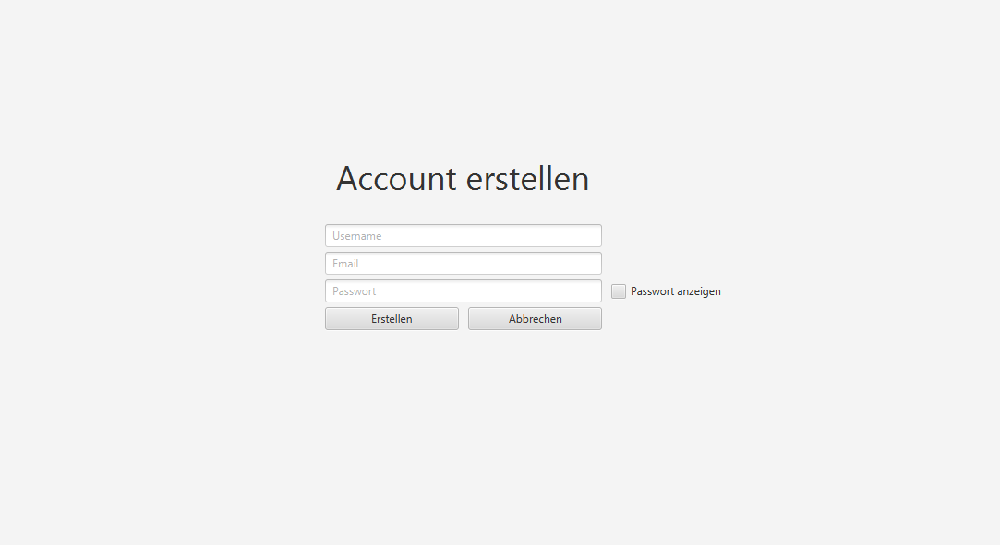
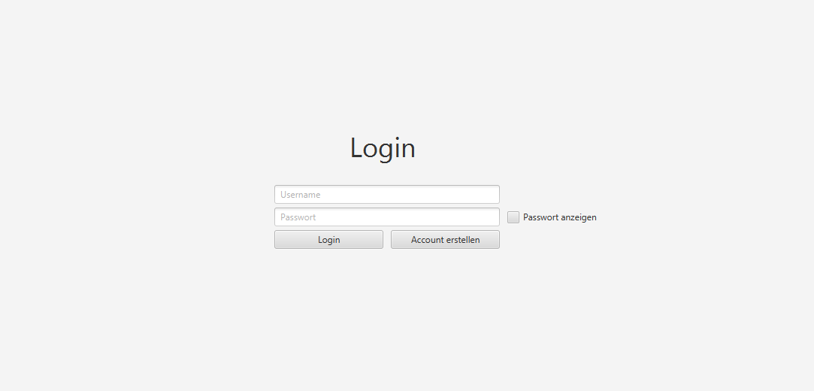
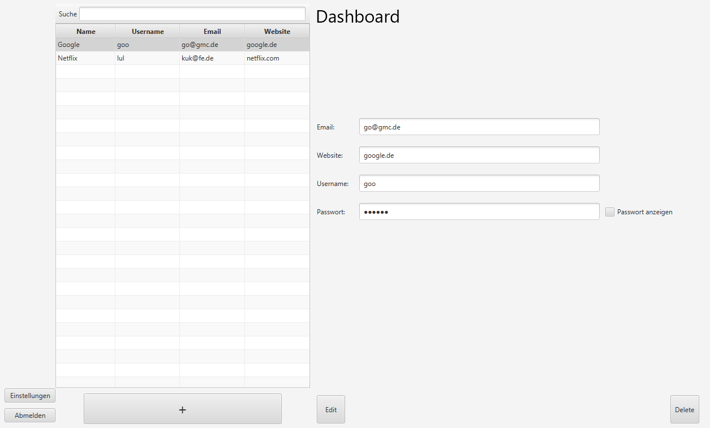
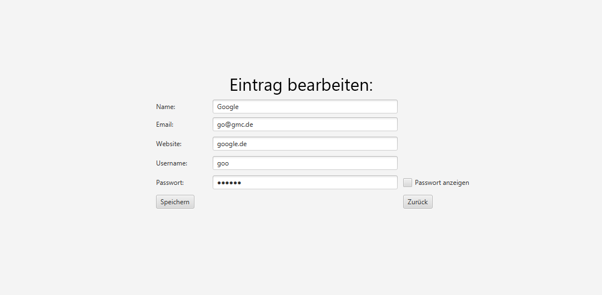
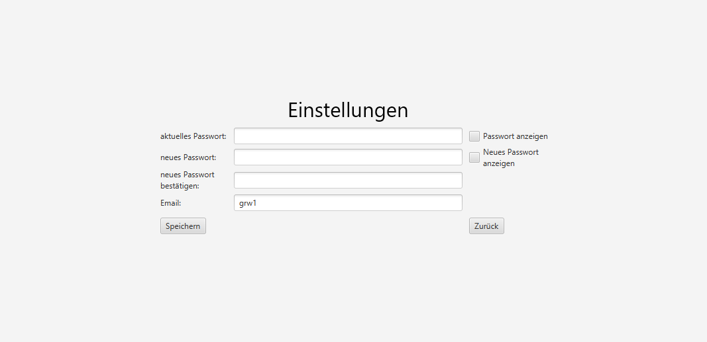

# Passwortmanager
School Project:
A simple password manager, which runs locally on the PC. 
Used to store passwords, so that they no longer have to be written on a piece of paper or memorized.

A database is created for all registered users and a database for each user with their password entries.

JDBC driver to encrypt databases: [sqlite-jdbc-crypt](https://github.com/Willena/sqlite-jdbc-crypt)

## Registration:

## Login:

## Dashboard:

## Edit an entry:

## User Settings:

